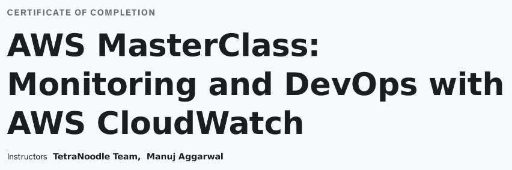
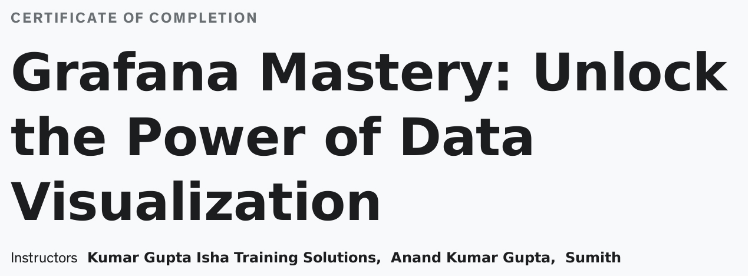

# Pre-Assignment Learning Path

- [ITL4 Course Notes](itil4-service-management/itil4_notes.md)

  

- [Jira Notes](jira-confluence/jira/jira_notes.md), [Confluence Notes](jira-confluence/confluence/confluence_notes.md)
  
  

- [AWS Master Class Notes](aws-master-class/aws_master_class_notes.md)
  

- [Grafana Notes](grafana/grafana_notes.md), [Prometheus Notes](grafana/prometheus_notes.md), [How to Provision EC2 to Use Prometheus as a Data Source on Grafana Using Terraform](grafana/provision-ec2/how-to.md)
  