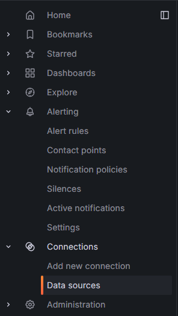
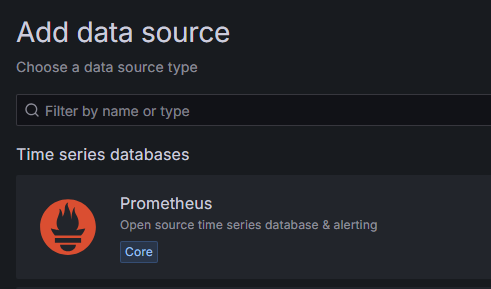
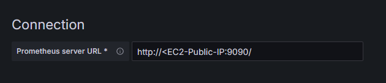

- [Section 1: Introduction to Grafana: What Is Is and Why You Need It](#section-1-introduction-to-grafana-what-is-is-and-why-you-need-it)
  - [1. Overview of Grafana](#1-overview-of-grafana)
    - [What is Grafana?](#what-is-grafana)
  - [2. Grafana Deployment Options](#2-grafana-deployment-options)
    - [Available Modes](#available-modes)
  - [3. Why Grafana?](#3-why-grafana)
  - [4. Integration with Prometheus](#4-integration-with-prometheus)
  - [5. Use Cases and Data Sources](#5-use-cases-and-data-sources)
    - [Supported Data Sources](#supported-data-sources)
    - [Use Cases](#use-cases)
  - [6. Training Modules Overview](#6-training-modules-overview)
    - [Key Topics](#key-topics)
  - [Create an EC2 Instance with Grafana Installed](#create-an-ec2-instance-with-grafana-installed)
    - [Setting up the EC2 instance](#setting-up-the-ec2-instance)
    - [Install Docker](#install-docker)
    - [Pull and run the Grafana Docker Image](#pull-and-run-the-grafana-docker-image)
    - [Go to the Grafana UI](#go-to-the-grafana-ui)
  - [Create an EC2 Instance with Prometheus Installed](#create-an-ec2-instance-with-prometheus-installed)
    - [Setting up the EC2 instance](#setting-up-the-ec2-instance-1)
    - [Install Prometheus and Prometheus Node Exporter and Configure the YAML file](#install-prometheus-and-prometheus-node-exporter-and-configure-the-yaml-file)
    - [Start, enable and access the Prometheus UI](#start-enable-and-access-the-prometheus-ui)
  - [Back on Grafana: Adding a data source](#back-on-grafana-adding-a-data-source)
  - [Grafana OSS Setup as a Service on AWS, User and Access Provisioning.](#grafana-oss-setup-as-a-service-on-aws-user-and-access-provisioning)
    - [Hardware Requirements for Grafana](#hardware-requirements-for-grafana)
    - [Grafana Database](#grafana-database)
  - [Implementation Steps](#implementation-steps)
  - [Setting up EC2 Instance](#setting-up-ec2-instance)
  - [Install Grafana as a Standalone Binary](#install-grafana-as-a-standalone-binary)
    - [Make sure Grafana binary is available](#make-sure-grafana-binary-is-available)
    - [Extract and Start Grafana](#extract-and-start-grafana)
    - [Check for Grafana Server Utility](#check-for-grafana-server-utility)
    - [Create a Service for Grafana](#create-a-service-for-grafana)
    - [Service File Content](#service-file-content)
      - [How to Navigate Controls Using 'vi' (vim)](#how-to-navigate-controls-using-vi-vim)
    - [Enable and Start Grafana Service](#enable-and-start-grafana-service)
    - [Access Grafana](#access-grafana)
    - [User Congifuration](#user-congifuration)
  - [Configuration Steps](#configuration-steps)
    - [Initial Setup](#initial-setup)
    - [Important Notes](#important-notes)
    - [Teams and Organisations](#teams-and-organisations)
    - [Practical Usage](#practical-usage)
  - [Notes on Grafana: Workspaces, Cloud Integration, and User Administration](#notes-on-grafana-workspaces-cloud-integration-and-user-administration)
    - [Workspaces](#workspaces)
    - [Cloud Integration (AWS CloudWatch Example)](#cloud-integration-aws-cloudwatch-example)
    - [User Administration](#user-administration)
    - [Key Takeaways](#key-takeaways)

# Section 1: Introduction to Grafana: What Is Is and Why You Need It

## 1. Overview of Grafana
### What is Grafana?
- An **open-source visualization tool** for monitoring and observability.
- **Core Functionality**: Offers advanced visualization for backend data sources.
- **Adoption**: Popular in organizations like Intel, Apple, and PayPal for infrastructure and application monitoring.
- **Key Use Cases**: Infrastructure monitoring, application health tracking, and supporting observability frameworks.

---

## 2. Grafana Deployment Options
### Available Modes
1. **Grafana Open Source (OS)**:
   - Community-supported.
   - Free to use with no Service-Level Agreement (SLA).
   - Vulnerability management depends on community contributions.
2. **Grafana Enterprise**:
   - Paid solution with enterprise-level support and SLAs.
   - Offers enhanced features and integration plugins.
3. **Grafana SaaS (Managed by Grafana Labs)**:
   - Fully managed solution with backend handled by Grafana Labs.
   - Suitable for organizations needing reduced infrastructure management.

---

## 3. Why Grafana?
- Offers **enriched visualization** compared to Prometheus or other monitoring tools.
- Supports various types of graphs: Time series, gauge, tables, and more.
- Easily integrates with **Prometheus**, **InfluxDB**, **CloudWatch**, and other data sources.
- Provides **template variables** for creating dynamic, reusable dashboards.

---

## 4. Integration with Prometheus
- Prometheus acts as a **time-series database** backend for Grafana.
- **Data Collection**:
  - Prometheus uses exporters to scrape metrics from sources like infrastructure (Node Exporter) and applications.
  - Stores data in its time-series database.
- Grafana visualizes the collected metrics via Prometheus.

---

## 5. Use Cases and Data Sources
### Supported Data Sources
- Prometheus (default for training sessions).
- InfluxDB, CloudWatch, SQL Server (to be covered in specific scenarios).
- Future exploration: Kubernetes monitoring, Telegraf integrations.

### Use Cases
- Infrastructure monitoring (CPU, memory, disk utilization).
- Application performance monitoring (API metrics, logs).
- Real-time security alerts visualization with time-series formatted data.

---

## 6. Training Modules Overview
### Key Topics
1. **Dashboarding**:
   - Creating and customizing dashboards.
   - Best practices for effective data representation.
2. **Installation**:
   - Dockerized deployment of Grafana.
   - Setting up Grafana on AWS EC2 instances.
3. **Data Source Management**:
   - Adding and managing data sources in Grafana.
   - Connecting Grafana to Prometheus and other supported backends.
4. **Advanced Features**:
   - Alerts and notifications.
   - User and workspace management.
   - LDAP integration for user authentication.
5. **Plugins and Customization**:
   - Extending functionality with plugins.
   - Annotation for improved insight.
6. **Performance Optimization**:
   - Fine-tuning Grafana for scalability and efficiency.

## Create an EC2 Instance with Grafana Installed

### Setting up the EC2 instance
1. Set up an EC2 instance using Ubuntu. Ensure the security group allows `SSH` and port `3000`.
2. `sudo apt-get update` and `sudo DEBIAN_FRONTEND=noninteractive apt-get upgrade -y`.

### Install Docker
1. Install Docker: `sudo apt-get install docker.io -y`
2. Start Docker Service: `sudo systemctl start docker`
3. Check docker status: `sudo systemctl status docker`
4. Enable Docker to Start at Boot: `sudo systemctl enable docker`
 
### Pull and run the Grafana Docker Image
1. Pull the Latest Grafana Image: `sudo docker pull grafana/grafana`
2. Run the Container: `sudo docker run -d -p 3000:3000 --name=grafana grafana/grafana`

### Go to the Grafana UI
1. Use the EC2 public IP with the port `3000` to access the Grafana UI. The default login details are:
   - **username**: `admin` 
   - **password**: `admin`

## Create an EC2 Instance with Prometheus Installed

### Setting up the EC2 instance
1. Set up an EC2 instance using Ubuntu. Ensure the security group allows `SSH`, `HTTP` and port `9090` (Prometheus uses this port).
2. `sudo apt-get update` and `sudo DEBIAN_FRONTEND=noninteractive apt-get upgrade -y`.

### Install Prometheus and Prometheus Node Exporter and Configure the YAML file
1. Insert the following command: `sudo apt-get install prometheus prometheus-node-exporter -y`.
2. Edit the Prometheus config file: `sudo nano /etc/prometheus/prometheus.yml`
3. Add or modify the scrape targets IF necessary: 

```yaml
scrape_configs:
  - job_name: 'prometheus'
    static_configs:
      - targets: ['localhost:9090']
```

### Start, enable and access the Prometheus UI
1. Start Prometheus using: `sudo systemctl start prometheus`.
2. Enable it using: `sudo systemctl enable prometheus`.
3. Access it using your EC2's public IP with a port of `9090`.

## Back on Grafana: Adding a data source
1. Select `Data sources` under `Connections`:



2. Select `Add data source` (it's a big blue button so I will NOT be giving you a screenshot).
3. Select `Prometheus`. You may need to search for it.



4. Once selected, name it whatever you like and then edit the connection to use the Public IP of your EC2 instance with Prometheus installed on it:



5. Select `Save & test`. It should prompt you to begin building a dashboard. If you select `Data sources` again, you'll now see `Prometheus` there.

## Grafana OSS Setup as a Service on AWS, User and Access Provisioning.

### Hardware Requirements for Grafana
* The CPU should handle both **user management** and **data processing**.
  * The number of users, dashboards, and alerts can impact CPU requirements.
* **Minimum Hardware Requirements**: Grafana requires a minimum of **512 MB RAM** and one CPU or VCPU.
 
### Grafana Database
* **Native Database**: Grafana uses **SQLite** by default to store configurations, user data, data sources, alerts, dashboards, and team/workspace information.
* **Supported Databases**: Grafana also supports MySQL, PostgreSQL, and other relational databases.
 
## Implementation Steps
* **Using Grafana Binaries**: Utilise Grafana binaries for installation.
  * For this training course, Grafana version 9.3.15 is used.
* **Version Selection**: Organisations often use the N-1 stable version to avoid immediate bugs.
  * The latest version is 10.4, but 9.3.15 is chosen for stability.

## Setting up EC2 Instance
1. Navigate to AWS and Launch an Instance:
   * Go to the AWS Management Console and click on "Launch instance".
 
2. Instance Details:
   * Name: Enter a name.
   * Image: Select the Amazon Linux 2023 AMI (Amazon Machine Image).
   * Size: Choose the t2.micro instance type (eligible for the free tier).
   * Key Pair: Select or create a key pair named georgia-grafana-aws for SSH access.
   * Security Group: Create a security group named georgia-grafana-test-allow-ssh-3000 with the following rules:
     * Allow SSH access on port 22.
     * Allow HTTP access on port 3000.
 
3. Launch the Instance:
   * Click "Launch instance" to start your EC2 instance.
 
## Install Grafana as a Standalone Binary
Source: https://grafana.com/grafana/download
 
* Version: 9.3.15
* Edition: Enterprise.
 
### Make sure Grafana binary is available
* SSH into instance: 'georgia-grafana-aws-test-2'
* Switch to root user: `sudo su -`
* Create a directory for Grafana: `mkdir /opt/grafana`
* Navigate to the directory: `cd /opy/frafana`
* Download the Grafana binary:
 
```bash
`wget https://dl.grafana.com/enterprise/release/grafana-enterprise-9.3.15.linux-amd64.tar.gz`
```

### Extract and Start Grafana
 
* Now we have Grafana binary available.
* Extract the downloaded binary:
  * `tar -xvzf grafana-enterprise-9.3.15.linux-amd64.tar.gz`
* List the contents to verify: `ls -al`

### Check for Grafana Server Utility
 
* Check if it has a Grafana Server utility:
  * Navigate to the Grafana directory: `cd grafana-9.3.15/`
  * List the contents: `ls`
 
* Navigate to the bin directory: `cd bin`
* ist the contents to ensure the server utility is present: `ls`
 
### Create a Service for Grafana
* Open the systemd directory: `cd /etc/systemd/system`
* Create and edit the service file: `vi grafana-server.service`
 
### Service File Content
Add the following content to the service file:
 
```bash
[Unit]
Description=Grafana
Documentation=http://docs.grafana.org
Wants=network-online.target
After=netwrok-online.target
 
[Service]
User=root
type=simple
WorkingDirectory=/opt/grafana/grafana-9.3.15
ExecStart=/opt/grafana/grafana-9.3.15/bin/grafana-server web
 
[Install]
WantedBy=multi-user.target
```

#### How to Navigate Controls Using 'vi' (vim)
* Enter Insert Mode: `i` to make changes.
* Exit Insert Mode: Press `Esc`.
* Save and Exit: Type `:wq` and press `Enter`.
 
### Enable and Start Grafana Service
* Reload Systemd Daemon: `systemctl daemon-reload`
* Enable Grafana Service: `systemctl enable grafana-server.service`
* Start the service: `systemctl start grafana-server.service`
* Check status: `systemctl status grafana-server.service`
 
Enable Sigv4 authentication through built in AWS-SDK in Grafana
* `systemctl daemon-reload`
* `AWS_SDK_LOAD_CONFIG=true`
* `GF_AUTH_SIGV4_AUTH_ENABLED=true`
 
> Use this if you are coming into an error.
 
### Access Grafana
You should now be able to access Grafana.
* Take the public IP from your instance.
  * "georgia-grafana-aws-test-2" in my case.
* And add `:3000` onto the end in a web browser.
* To login: admin, admin.
  * Then choose a password if you'd like or click "skip".
 
### User Congifuration
* In the bottom left corner of Grafana, click on "Configuration" > "Teams".
* This is where you can add users/ group multiple users.
 
## Configuration Steps
### Initial Setup
`Start Grafana`
* Verify Grafana is running by ensuring port 3000 is accessible.
* Check security group configurations if it does not start.
 
`User Configuration`
* Default user: admin (has server admin permissions).
* Additional users may have limited permissions unless explicitly elevated.
* User permissions are role-based and configurable (e.g., Admin, Editor, Viewer).
 
`SMTP Configuration`
* SMTP is required for sending emails (e.g., notifications or invitations).
* Edit the grafana.ini file to include SMTP server details.
  * Example use case: Email notifications for alerts.
 
### Important Notes
* Grafana's features like multi-tenancy and user management require proper backend configurations.
* SMTP setup ensures email-based alerts work.
* Always verify permissions to ensure secure and proper access.
 
### Teams and Organisations
`Teams`
* Used to group multiple users for collaborative dashboards and alerts.
  * Example: A "Performance Engineering" team can have all relevant testers.
 
`Organisations`
* Separate Grafana workspaces for different teams or divisions.
  * Example: A company like HCL can have one organisation for BPO and another for Software Development.
* Managed via Server Admin Permissions.
 
### Practical Usage
`Grafana on Windows`
* Simpler installation process compared to Linux.
* Ideal for monitoring in Windows-based environments.
 
`Integrations`
* Tools like Kibana or CloudWatch can be integrated for enhanced functionality.
* CloudWatch integration will be covered in the next session.

## Notes on Grafana: Workspaces, Cloud Integration, and User Administration

### Workspaces
- **Definition**: Workspaces in Grafana are equivalent to **folders** that store dashboards, alerts, and related configurations.
- **Purpose**:
  - Organize dashboards based on teams, projects, or purposes.
  - Segregate data for better access control.
- **Management**:
  - Create new workspaces for specific teams or applications.
  - Assign permissions to workspaces to restrict or grant access.
  - Example:
    - Workspace: `Performance Engineering`
    - Contains dashboards for monitoring performance metrics.
- **Permissions**:
  - **Viewer**: Can view dashboards but cannot edit or create them.
  - **Editor**: Can create and edit dashboards but cannot configure system-wide settings.
  - **Admin**: Full control, including user and workspace management.
- **Workspace Governance**:
  - Use `Manage Permissions` to control access to specific workspaces.
  - Remove permissions for users who should not have visibility into certain workspaces.

---

### Cloud Integration (AWS CloudWatch Example)
- **Purpose**:
  - Integrate Grafana with cloud services like **AWS CloudWatch** for monitoring infrastructure metrics.
  - Leverage Grafana’s visualization capabilities to analyze cloud-native metrics.
- **Integration Steps**:
  1. **Create IAM Role and Policy**:
     - IAM role defines permissions for accessing specific metrics (e.g., EC2, S3).
     - Example permissions for CloudWatch:
       - `GetMetricData`
       - `ListMetrics`
     - Apply `read-only` permissions to prevent unintended changes.
  2. **Create Access Keys**:
     - Programmatic access credentials are used by Grafana to query metrics.
  3. **Configure Grafana**:
     - Add CloudWatch as a **data source** in Grafana.
     - Use access keys or IAM role-based authentication for secure integration.
  4. **Test Integration**:
     - Query metrics (e.g., `CPUUtilization`) from the CloudWatch namespace to verify connectivity.
  5. **Create Dashboards**:
     - Visualize metrics like CPU usage, memory, or storage across services (e.g., EC2, S3).
- **Key Concepts**:
  - **Namespaces**: Represent AWS services (e.g., `EC2`, `S3`).
  - **Query Builder**: Used to filter and visualize specific metrics from CloudWatch.
  - **Alerting**: Alerts can be set up based on metric thresholds (e.g., if CPU utilization exceeds 80%).

---

### User Administration
- **User Roles**:
  - **Viewer**:
    - Default role with read-only access.
    - Can view dashboards but cannot modify or create them.
  - **Editor**:
    - Can create, edit, and delete dashboards within their assigned scope.
    - Cannot manage system-wide configurations or users.
  - **Admin**:
    - Full access, including user management, plugin installation, and permissions.
    - Can create, delete, or modify teams and workspaces.
- **Managing Users**:
  - Invite users via email to join Grafana.
  - Assign specific roles (Viewer, Editor, or Admin) based on responsibilities.
- **Teams**:
  - **Definition**: Groups of users within Grafana, created to organize and manage access.
  - **Use Case**:
    - Assign team-level permissions for specific workspaces or dashboards.
    - Example Teams:
      - `Performance Engineering`
      - `Application Engineering`
  - **Permissions**:
    - Each team can have its own set of access rights (view, edit, admin) for specific workspaces or dashboards.
- **Server Admin**:
  - A superuser role with the ability to manage the entire Grafana server.
  - Includes advanced capabilities such as:
    - Organization settings.
    - Licensing.
    - System-wide statistics.

---

### Key Takeaways
- Workspaces help organize dashboards and manage access in a scalable way.
- Cloud integration like AWS CloudWatch allows advanced monitoring and visualization.
- User administration ensures proper access control and team-based segregation of data.
